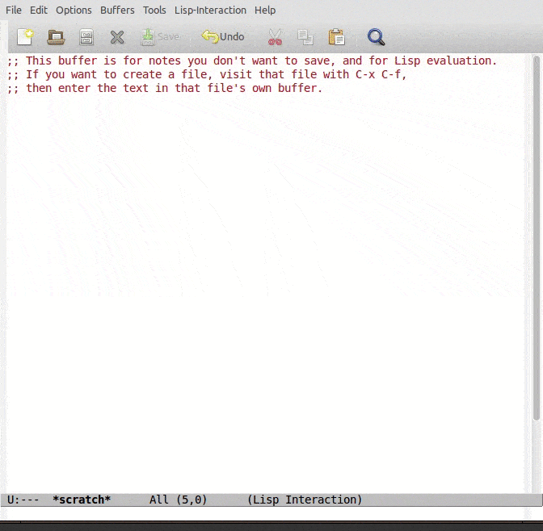

# Epoxide
A Modular Troubleshooting Framework for SDN

Epoxide is an Emacs based modular framework, which can flexibly
combine network and software troubleshooting tools in a single
platform.  Epoxide does not try to be a complex troubleshooting
software that fully integrates all available tools, but rather a
lightweight framework that allows the ad-hoc creation of tailor-made
testing methods from predefined building blocks to test
troubleshooting hypotheses.

I. Pelle, T. Lévai, F. Németh, and A. Gulyás: "One Tool to Rule Them
All: A Modular Troubleshooting Framework for SDN (and other)
Networks", ACM Sigcomm Symposium on SDN Research (SOSR), June 17-18,
2015, Santa Clara, CA.  http://dx.doi.org/10.1145/2774993.2775014

[SIGCOMM 2015 demo video](https://www.youtube.com/watch?v=HsiGFR0QirE)

# Installation

Add the following lines to your emacs initialization file (~/.emacs):

```
  (package-initialize)
  (add-to-list 'package-archives
               '("epoxide" . "http://nemethf.github.io/epoxide/") t)
```

Then install the `epoxide' package with M-x list-packages RET.

To utilize graph visualisation install graphviz from your
distribution's package manager or from any other source.

## Installation from the git repository

First install cogre either from the CEDET git repository or from the
package archive of Epoxide (see above), then add the following lines
to your initialization file.

```
  (add-to-list 'load-path "path-to-the-epoxide-repository/src")
  (autoload 'epo-mode "epoxide")
  (add-to-list 'auto-mode-alist '("\\.tsg\\'" . epoxide-tsg-mode))
  (autoload 'tramp-mininet-setup "tramp-mininet")
  (eval-after-load 'tramp '(tramp-mininet-setup))
```

# Usage

## Demonstration

The demonstrated scenario is the following: we want to test our host's
connection to the public internet. We want to check its connectivity
and we want to measure its latency to some well-known websites.

Fortunately, the release Epoxide version contains a suiting
troubleshooting graph (TSG) for this scanario. It consists of a `ping`
wrapper node named as Ping and a regular expression matching Filter
which emphasise ping tries with greater or equal than 20 ms response
time.

If this is your first time using Epoxide, you should read the article
and watch the video mentioned in the introduction. But do not be
afraid, the learning curve of Epoxide is not really steep if you are
familiar with Emacs. Returning to our demo scenario, executing a TSG
describing the troubleshooting process itself is just opening the
corresponding `.tsg` file (for further details see 'Edit
troubleshooting graphs'). You can simply do that by issuing a <kbd>C-x
C-f ~/.emacs.d/elpa/epoxide-0.6.3/examples/ping.tsg
RET</kbd>. Depending on your setup the execution starts automatically
or you have to press <kbd>C-x C-e y</kbd> to start the execution. As
the execution starts, the Emacs frame splits horizontally and you can
see the `.tsg` file and the output of the last link in the
TSG. Currently it is the output of `ping` with lines emphasised in
case of greater or equal than 20 ms response time.

Let us suppose that we want to check the connectivity with a different
target. It is really simple to that with Epoxide. All you have to do
is modifying the second parameter of Ping and reevaluate the `.tsg`
file with <kbd>C-x C-e y</kbd>.



At this point we have a running TSG which we want to examine. The main
purpose behind examining a TSG in details is to see the data-flow
itself and to modify node variables on-the-fly. In order to ease the
TSG orientation Epoxide can provide a graphical representation of the
TSG by pressing <kbd>M-x t</kbd> or <kbd>C-x g</kbd>. Nodes can be
easily accessed from this view by clicking on their name or using key
bindings (<kbd>C-x p</kbd> and <kbd>C-x n</kbd>).

Every node has its own buffer in which there is a small help and the
node's variables can be accessed by pressing <kbd>v</kbd>; these
variables can be modified on-the-fly. Even the links between the nodes
can be altered this way.

It is also possible to navigate through the TSG via the links. Press
<kbd>C-x n</kbd> or <kbd>M-n</kbd> to jump to the following link/node,
and <kbd>C-x p</kbd> or <kbd>M-p</kbd> to the previous one. If you
want to jump back to the `.tsg` file, press <kbd>M-g e</kbd>.


It is a legal claim to do the two pinging at once. Presenting the TSG
modification is not in the scope of this demonstration, section 'Edit
troubleshooting graphs' is dedicated for this topic. There is an
example TSG ([pingview.tsg](examples/pingview.tsg)) which provides
this parallel pinging functionality. Moreover, that TSG file also
introduces an another core feature of Epoxide, namely the usage of
views. Views were implemented in order to provide a solution for the
common need to see multiple outputs aligned at once in a simple yet
flexible way. Views can be added to TSGs as they were nodes.

If there are views in a TSG, the last one will be activated at the
beginning of the execution. Other views can be activated with the
numeric prefix <kbd>M-g v</kbd> key binding, or you can cycle through
the defined views by pressing <kbd>M-p</kbd> or <kbd>M-n</kbd> as you
can see it in the animation.


## Edit troubleshooting graphs

Epoxide uses a Click-inspired language for describing troubleshooting
graphs (TSGs). TSGs are stored in `.tsg` files, as an example take a
look at the content of [pingview.tsg](examples/pingview.tsg).

```
// Nodes
view :: View(1, 2);
ping0 :: Ping(localhost, yahoo.com);
ping1 :: Ping(localhost, google.com);
filter0 :: Filter(time=\([2-9][0-9]\|[1-9][0-9]\{2,\}\).*[0-9]* ms$);
filter1 :: Filter(time=\([2-9][0-9]\|[1-9][0-9]\{2,\}\).*[0-9]* ms$);

// Links
ping0 -> filter0 -> view;
ping1 -> filter1 -> [1]view;
```

As you can see, TSG description has two main logical parts: the first
is the description of nodes and views of the troubleshooting graph and
the second is the description of the links between them.

It is really easy to create new TSGs or modify existing ones due to
the convenient TSG editing features of Epoxide: syntax highlighting;
Eldoc integration; keyboard shortcuts for controlling execution of the
TSG and the nodes.

## Implement new nodes

Currently, Epoxide can only provide a limited number of predefined
nodes, therefore, can not cover every unique use-case. On such
occasions, the functionality of Epoxide can be easily extended by
implementing new nodes. Nodes are written in [Emacs
Lisp](http://www.emacswiki.org/emacs/EmacsLisp) using some
Epoxide-specific data structure which are well-documented in the
source code.

To implement a new node the following three Epoxide framework-specific
function have to be included in the node describing file:

- `epoxide-nodename-start` is called when the node initialises

- `epoxide-nodename-exec` contains the function of the node, this is
  the function called by the scheduler during TSG execution

- `epoxide-nodename-stop` is called when the node stops

Additional documentation-aiding functions can be added to a node:

- `epoxide-nodename-input-info` provides documentation, value tips and
  validation for input fields

- `epoxide-nodename-config-info` provides documentation, value tips
  and validation for configuration fields

- `epoxide-nodename-output-info` provides documentation, value tips
  and validation for output fields

The node definition file should be placed in the `src/nodes/` as
`Nodename.el`.

As an example take a look at the [Ping node](src/nodes/Ping.el).

## Keyboard shortcuts

Troubleshooting Graph (TSG) execution:

- <kbd>C-x C-e</kbd> clears and starts execution of the TSG
- <kbd>C-c C-e</kbd> starts the execution of the TSG

TSG modification:

- <kbd>C-c C-a</kbd> adds a new node to the TSG
- <kbd>C-c C-r</kbd> restarts a node

Navigation, views, etc:

- <kbd>v</kbd> shows Epoxide variable list
- <kbd>c</kbd> customise Epoxide variables
- <kbd>C-x C-b</kbd> shows the Epoxide specific Ibuffer list
- <kbd>C-x g</kbd> and <kbd>M-x t</kbd> show the TSG visualisation
- <kbd>M-g e</kbd> shows the TSG file
- <kbd>C-x n</kbd> jumps to the following node
- <kbd>C-x p</kbd> jumps to the preceding node
- <kbd>C-c C-o</kbd> shows all output buffer of the active node
- <kbd>M-n</kbd> jumps to the next buffer in TSG
- <kbd>M-p</kbd> jumps to the previous buffer in TSG
- <kbd>C-[1-9] M-g v</kbd> activates View #[1-9]
- <kbd>M-N</kbd> activates next View
- <kbd>M-P</kbd> activates previous View


# Acknowledgement

The research leading to these results has received funding from the
European Union Seventh Framework Programme under grant agreement
No. 619609.  See https://www.fp7-unify.eu/
