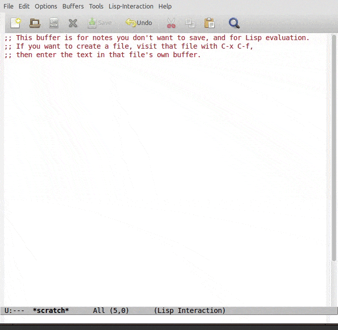
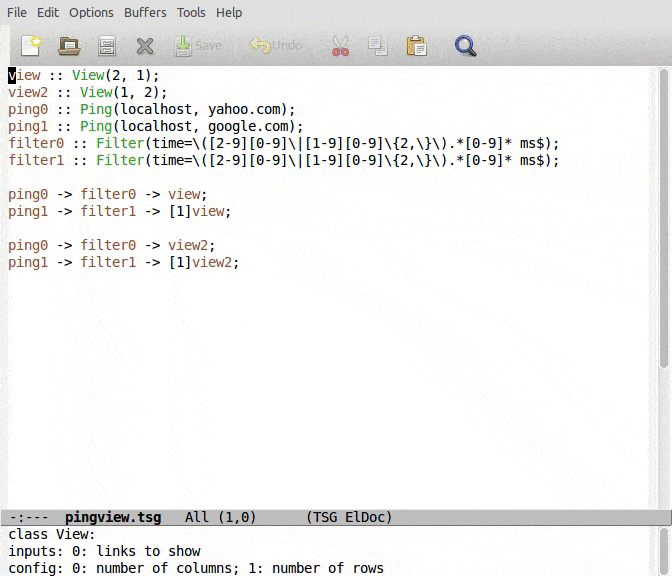

# Epoxide
A Modular Troubleshooting Framework for SDN

Epoxide is an Emacs based modular framework, which can flexibly
combine network and software troubleshooting tools in a single
platform.  Epoxide does not try to be a complex troubleshooting
software that fully integrates all available tools, but rather a
lightweight framework that allows the ad-hoc creation of tailor-made
testing methods from predefined building blocks to test
troubleshooting hypotheses.

I. Pelle, T. Lévai, F. Németh, and A. Gulyás: "One Tool to Rule Them
All: A Modular Troubleshooting Framework for SDN (and other)
Networks", ACM Sigcomm Symposium on SDN Research (SOSR), June 17-18,
2015, Santa Clara, CA.  http://dx.doi.org/10.1145/2774993.2775014

# Installation

Add the following lines to your emacs initialization file (~/.emacs):

```
  (package-initialize)
  (add-to-list 'package-archives
               '("epoxide" . "http://nemethf.github.io/epoxide/") t)
```

Then install the `epoxide' package with M-x list-packages RET.

## Installation from the git repository

First install cogre either from the CEDET git repository or from the
package archive of epoxide (see above), then add the following lines
to your initialization file.

```
  (add-to-list 'load-path "path-to-the-epoxide-repository/src")
  (autoload 'epo-mode "epoxide")
  (add-to-list 'auto-mode-alist '("\\.tsg\\'" . epoxide-tsg-mode))
  (autoload 'tramp-mininet-setup "tramp-mininet")
  (eval-after-load 'tramp '(tramp-mininet-setup))
```

# Usage

## Demos

Execute a troubleshooting graph.


Navigate between nodes.


Use views to modify layout of the windows.


## Keyboard shortcuts

Troubleshooting Graph (TSG) execution:

- <kbd>C-x C-e</kbd> clears and starts execution of the TSG
- <kbd>C-c C-e</kbd> starts the execution of the TSG

TSG modification:

- <kbd>C-c C-a</kbd> adds a new node to the TSG
- <kbd>C-c C-r</kbd> restarts a node

Navigation, views, etc:

- <kbd>v</kbd> shows Epoxide variable list
- <kbd>c</kbd> customise Epoxide variables
- <kbd>C-x C-b</kbd> shows the Epoxide specific Ibuffer list
- <kbd>C-x g</kbd> and <kbd>M-x t</kbd> show the TSG visualisation
- <kbd>M-g e</kbd> shows the TSG file
- <kbd>C-x n</kbd> jumps to the following node
- <kbd>C-x p</kbd> jumps to the preceding node
- <kbd>C-c C-o</kbd> shows all output buffer of the active node
- <kbd>M-n</kbd> jumps to the next buffer in TSG
- <kbd>M-p</kbd> jumps to the previous buffer in TSG
- <kbd>C-[1-9] M-g v</kbd> activates View #[1-9]
- <kbd>M-N</kbd> activates next View
- <kbd>M-P</kbd> activates previous View

## Implement new nodes


# Acknowledgement

The research leading to these results has received funding from the
European Union Seventh Framework Programme under grant agreement
No. 619609.  See https://www.fp7-unify.eu/
